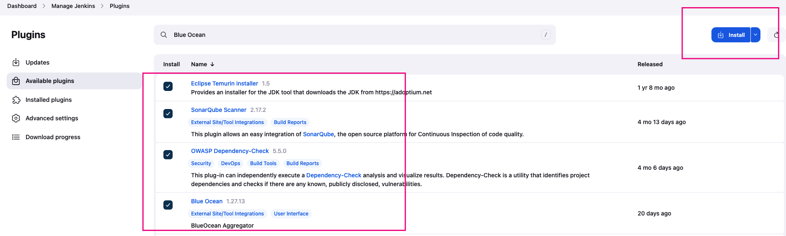

# **DevSecOps End-to-End Pipeline**

🚀 **DevOps** has revolutionized software delivery with speed and automation, but **security** must not be overlooked.  
🔐 Enter **DevSecOps** — integrating security into CI/CD pipelines from the start.

This project showcases practical tools for implementing DevSecOps in continuous integration workflows:

- **SonarQube** for code quality analysis  
- **OWASP Dependency-Check** for scanning vulnerable dependencies  
- **Conftest** for policy validation of Kubernetes, Terraform, and Dockerfiles  
- **Trivy** for container image vulnerability scanning  

📚 A hands-on guide to secure, automated development workflows. Enjoy the journey!

---

## 🛡️ Vulnerability

A **vulnerability** is a weakness in software, hardware, networks, or human processes that can be exploited to compromise a system’s availability, integrity, or security. These flaws range from simple misconfigurations to complex threats like zero-day attacks.

---

## 🔍 SonarQube

**SonarQube** is an open-source platform by SonarSource that continuously analyzes code quality, detects security vulnerabilities, and tracks technical debt across multiple programming languages. It integrates with CI/CD pipelines and popular IDEs like Eclipse, IntelliJ, and Visual Studio to provide real-time feedback during development.

### Key Uses:
- Static code analysis to detect bugs, code smells, and vulnerabilities  
- Supports Java, Python, JavaScript, TypeScript, C#, and more  
- Helps developers catch issues early in the development lifecycle

### Core Features:
- Code quality and security scanning  
- Technical debt tracking  
- CI/CD integration  
- Customizable rules and quality gates

---

## 🧪 OWASP Dependency-Check

**OWASP Dependency-Check** is a Software Composition Analysis (SCA) tool that identifies known vulnerabilities in a project's dependencies. It detects Common Platform Enumeration (CPE) identifiers and links them to relevant CVE entries.

### Highlights:
- Supports CLI, Maven, Ant, and Jenkins  
- Uses analyzers and third-party sources like NPM Audit, OSS Index, RetireJS  
- Automatically updates using NVD feeds from NIST

---

## 📜 Conftest

**Conftest** is a policy testing tool that uses the **Open Policy Agent (OPA)** to evaluate configuration files against custom rules written in the **Rego** language. It enforces security, compliance, and best practices across infrastructure-as-code.

### Common Use Cases:
- **Kubernetes**: Validates manifests for security and compliance  
- **Terraform**: Ensures infrastructure plans follow organizational policies  
- **Dockerfiles**: Checks for secure and optimized image build practices

---

## 🔍 Trivy

**Trivy** is an open-source vulnerability scanner designed specifically for containers. It detects known security issues in container images and filesystems by analyzing installed packages and libraries.

### Key Features:
- Comprehensive vulnerability database  
- Fast and efficient scanning  
- Easy integration into CI/CD pipelines  
- Multiple output formats  
- Continuous updates to stay current with threats

---

## Hands-On
- Let's include the devsecops tools we briefly mentioned above into the pipeline and do some hands-on. Let's get started.

### Step-1 Launch Instance
- Launch an OCI Instance Shape: VM.Standard.E5.Flex. Use the image as Oracle Linux. You can create a new key pair or use an existing one.

- Enable 80, 443, 8080 and 9000 port settings in the Security List.
- You can add the userdata below for Jenkins, Docker, Trivy installation.

```bash
#!/bin/bash
# update system
dnf update -y

# set Hostname
hostnamectl set-hostname jenkins-server

# Install Git
dnf install git -y

# Install Java 17 (Amazon Corretto or OpenJDK)
dnf install java-17-amazon-corretto-devel -y || dnf install java-17-openjdk-devel -y

# Install Jenkins
wget -O /etc/yum.repos.d/jenkins.repo https://pkg.jenkins.io/redhat-stable/jenkins.repo
rpm --import https://pkg.jenkins.io/redhat-stable/jenkins.io-2023.key
dnf upgrade -y
dnf install jenkins -y
systemctl enable jenkins
systemctl start jenkins

# Install Docker
dnf config-manager --add-repo=https://download.docker.com/linux/centos/docker-ce.repo
dnf install docker-ce docker-ce-cli containerd.io -y
systemctl enable --now docker

# Add users to docker group
usermod -aG docker opc
usermod -aG docker jenkins

# Configure Docker to expose TCP socket for Jenkins agents
cp /lib/systemd/system/docker.service /lib/systemd/system/docker.service.bak
sed -i 's|^ExecStart=.*|ExecStart=/usr/bin/dockerd -H tcp://127.0.0.1:2376 -H unix:///var/run/docker.sock|' /lib/systemd/system/docker.service
systemctl daemon-reload
systemctl restart docker
systemctl restart jenkins

# Install Trivy
dnf install wget -y
wget https://github.com/aquasecurity/trivy/releases/download/v0.31.3/trivy_0.31.3_Linux-64bit.rpm
rpm -ivh trivy_0.31.3_Linux-64bit.rpm
```

### Step-2 Configure Jenkins-Server

- After instance state running, we can configure the jenkins server.Now, grab your Public IP Address

```bash
In Browser <Instance-Public-IP-Address:8080>

sudo cat /var/lib/jenkins/secrets/initialAdminPassword
```
- Unlock Jenkins using an administrative password and install the required plugins.


- Jenkins will now get installed and install all the libraries.


### Step-3 Install Sonarqube as a Docker Container

- Go to Instance terminal and enter below code to install sonarqube

```bash
sudo docker run -d --name sonarqube -p 9000:9000 sonarqube:latest
```

```bash
<Instance-Public-IP-Address:9000>
username: admin
password: admin
```


### Step-4 Install Jenkins Plugins

- Go to Jenkins WebUI → Manage Jenkins → Plugins → Available Plugins, then install:

1. ### Eclipse Temurin Installer 
   - Automates JDK installation on agents  
   - Ensures correct Java version for builds

2. ### SonarQube Scanner  
   - Integrates code quality analysis into builds  
   - Sends results to SonarQube for detailed metrics

3. ### OWASP Dependency-Check  
   - Scans project dependencies for vulnerabilities  
   - Generates security reports to guide remediation

4. ### Blue Ocean 
   - Provides a graphical interface for pipelines  
   - Enhances visualization of build stages and status

