# **DevSecOps End-to-End Pipeline**

🚀 **DevOps** has revolutionized software delivery with speed and automation, but **security** must not be overlooked.  
🔐 Enter **DevSecOps** — integrating security into CI/CD pipelines from the start.

This project showcases practical tools for implementing DevSecOps in continuous integration workflows:

- **SonarQube** for code quality analysis  
- **OWASP Dependency-Check** for scanning vulnerable dependencies  
- **Conftest** for policy validation of Kubernetes, Terraform, and Dockerfiles  
- **Trivy** for container image vulnerability scanning  

📚 A hands-on guide to secure, automated development workflows. Enjoy the journey!

---

## 🛡️ Vulnerability

A **vulnerability** is a weakness in software, hardware, networks, or human processes that can be exploited to compromise a system’s availability, integrity, or security. These flaws range from simple misconfigurations to complex threats like zero-day attacks.

---

## 🔍 SonarQube

**SonarQube** is an open-source platform by SonarSource that continuously analyzes code quality, detects security vulnerabilities, and tracks technical debt across multiple programming languages. It integrates with CI/CD pipelines and popular IDEs like Eclipse, IntelliJ, and Visual Studio to provide real-time feedback during development.

### Key Uses:
- Static code analysis to detect bugs, code smells, and vulnerabilities  
- Supports Java, Python, JavaScript, TypeScript, C#, and more  
- Helps developers catch issues early in the development lifecycle

### Core Features:
- Code quality and security scanning  
- Technical debt tracking  
- CI/CD integration  
- Customizable rules and quality gates

---

## 🧪 OWASP Dependency-Check

**OWASP Dependency-Check** is a Software Composition Analysis (SCA) tool that identifies known vulnerabilities in a project's dependencies. It detects Common Platform Enumeration (CPE) identifiers and links them to relevant CVE entries.

### Highlights:
- Supports CLI, Maven, Ant, and Jenkins  
- Uses analyzers and third-party sources like NPM Audit, OSS Index, RetireJS  
- Automatically updates using NVD feeds from NIST

---

## 📜 Conftest

**Conftest** is a policy testing tool that uses the **Open Policy Agent (OPA)** to evaluate configuration files against custom rules written in the **Rego** language. It enforces security, compliance, and best practices across infrastructure-as-code.

### Common Use Cases:
- **Kubernetes**: Validates manifests for security and compliance  
- **Terraform**: Ensures infrastructure plans follow organizational policies  
- **Dockerfiles**: Checks for secure and optimized image build practices

---

## 🔍 Trivy

**Trivy** is an open-source vulnerability scanner designed specifically for containers. It detects known security issues in container images and filesystems by analyzing installed packages and libraries.

### Key Features:
- Comprehensive vulnerability database  
- Fast and efficient scanning  
- Easy integration into CI/CD pipelines  
- Multiple output formats  
- Continuous updates to stay current with threats

---

## Hands-On
- Let's include the devsecops tools we briefly mentioned above into the pipeline and do some hands-on. Let's get started.

### Step-1 Launch Instance
- Launch an OCI Instance Shape: VM.Standard.E5.Flex. Use the image as Oracle Linux. You can create a new key pair or use an existing one.

- Enable 80, 443, 8080 and 9000 port settings in the Security List.
- You can add the userdata below for Jenkins, Docker, Trivy installation.

```bash
#!/bin/bash
# update system
dnf update -y

# set Hostname
hostnamectl set-hostname jenkins-server

# Install Git
dnf install git -y

# Install Java 17 (Amazon Corretto or OpenJDK)
dnf install java-17-amazon-corretto-devel -y || dnf install java-17-openjdk-devel -y

# Install Jenkins
wget -O /etc/yum.repos.d/jenkins.repo https://pkg.jenkins.io/redhat-stable/jenkins.repo
rpm --import https://pkg.jenkins.io/redhat-stable/jenkins.io-2023.key
dnf upgrade -y
dnf install jenkins -y
systemctl enable jenkins
systemctl start jenkins

# Install Docker
dnf config-manager --add-repo=https://download.docker.com/linux/centos/docker-ce.repo
dnf install docker-ce docker-ce-cli containerd.io -y
systemctl enable --now docker

# Add users to docker group
usermod -aG docker opc
usermod -aG docker jenkins

# Configure Docker to expose TCP socket for Jenkins agents
cp /lib/systemd/system/docker.service /lib/systemd/system/docker.service.bak
sed -i 's|^ExecStart=.*|ExecStart=/usr/bin/dockerd -H tcp://127.0.0.1:2376 -H unix:///var/run/docker.sock|' /lib/systemd/system/docker.service
systemctl daemon-reload
systemctl restart docker
systemctl restart jenkins

# Install Trivy
dnf install wget -y
wget https://github.com/aquasecurity/trivy/releases/download/v0.31.3/trivy_0.31.3_Linux-64bit.rpm
rpm -ivh trivy_0.31.3_Linux-64bit.rpm
```

### Step-2 Configure Jenkins-Server

- After instance state running, we can configure the jenkins server.Now, grab your Public IP Address

```bash
In Browser <Instance-Public-IP-Address:8080>

sudo cat /var/lib/jenkins/secrets/initialAdminPassword
```
- Unlock Jenkins using an administrative password and install the required plugins.


- Jenkins will now get installed and install all the libraries.


### Step-3 Install Sonarqube as a Docker Container

- Go to Instance terminal and enter below code to install sonarqube

```bash
sudo docker run -d --name sonarqube -p 9000:9000 sonarqube:latest
```

```bash
In Browser <Instance-Public-IP-Address:9000>
username: admin
password: admin
```


### Step-4 Install Jenkins Plugins

- Go to Jenkins WebUI → Manage Jenkins → Plugins → Available Plugins, then install:

1. #### Eclipse Temurin Installer 
   - Automates JDK installation on agents  
   - Ensures correct Java version for builds

2. #### SonarQube Scanner  
   - Integrates code quality analysis into builds  
   - Sends results to SonarQube for detailed metrics

3. #### OWASP Dependency-Check  
   - Scans project dependencies for vulnerabilities  
   - Generates security reports to guide remediation

4. #### Blue Ocean 
   - Provides a graphical interface for pipelines  
   - Enhances visualization of build stages and status


### Step-5 Configure Java, Maven in Global Tool Configuration

- Go to Jenkins WebUI Manage Jenkins → Tools → Install JDK, Maven and SonarQube Scanner → Click on Apply and Save

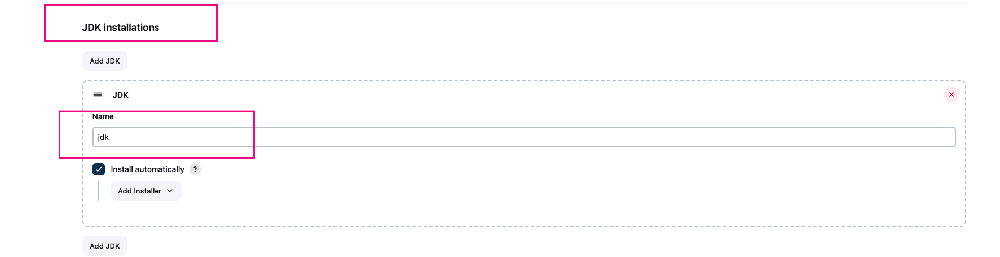

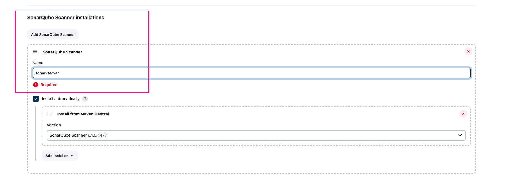

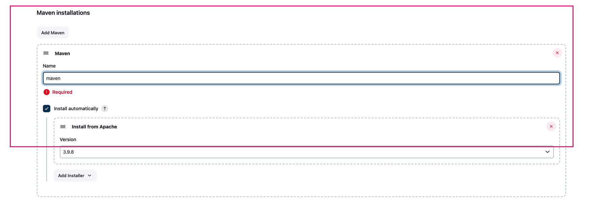


### Step-6 Configure Sonarqube in Manage Jenkins

```bash
In Browser <Instance-Public-IP-Address:9000>
```
- Go to your Sonarqube Server → Click on Administration → Security → Users → Click on Tokens and Update Token → Give it a name → and click on Generate Token

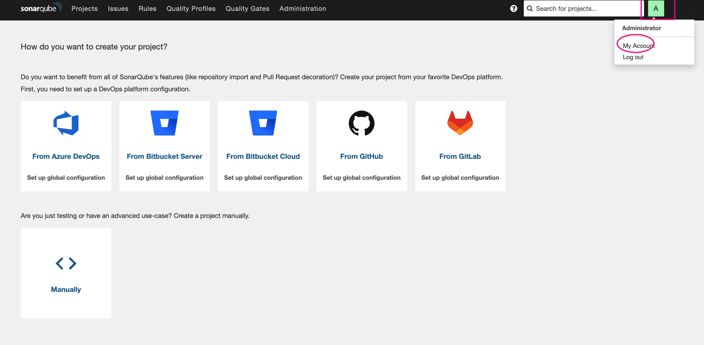

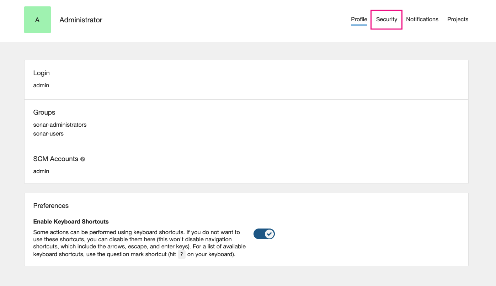

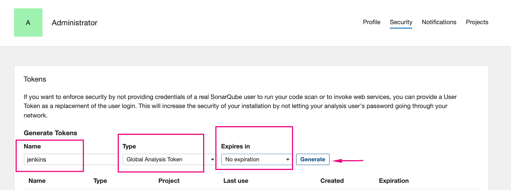

- Copy this Token
- Go to Jenkins WebUI → Manage Jenkins → Credentials → Add Secret Text.

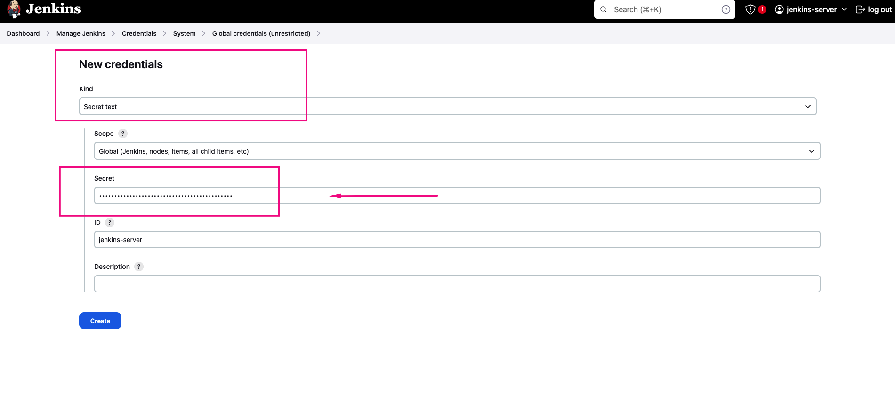

- Go to Jenkins Dashboard → Manage Jenkins → Configure System
- Give a name whatever you want
- Add Sonarqube url
- Select sonarqube credential token

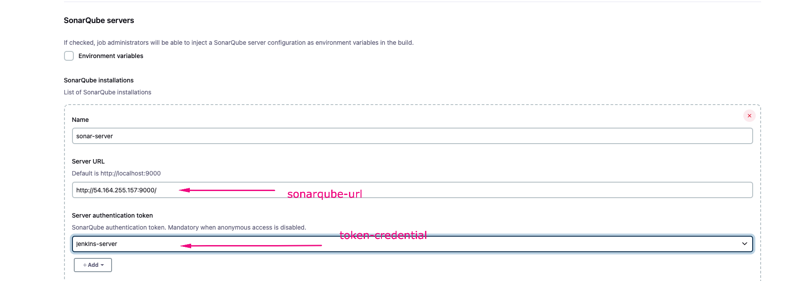

### Step-7 WebHook Configuration on Sonarqube

- Go to SonarQube WebUI → Administration → Configuration → webhooks

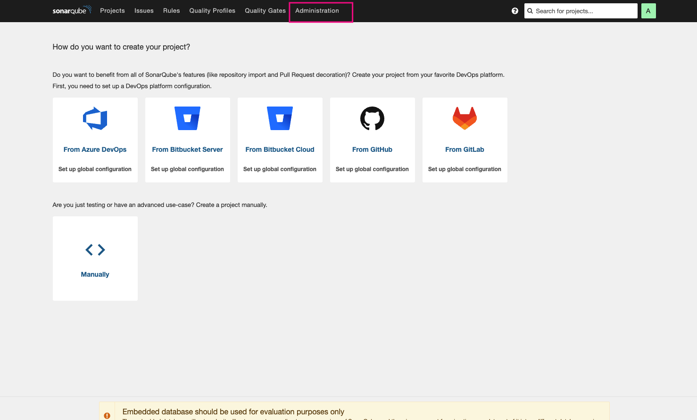
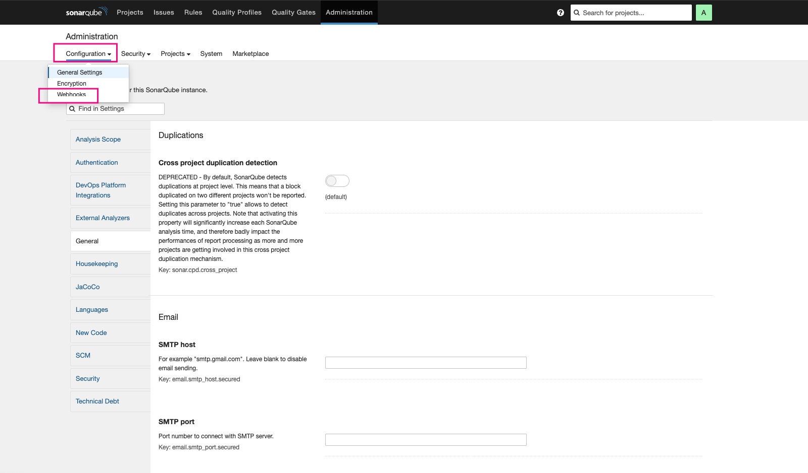
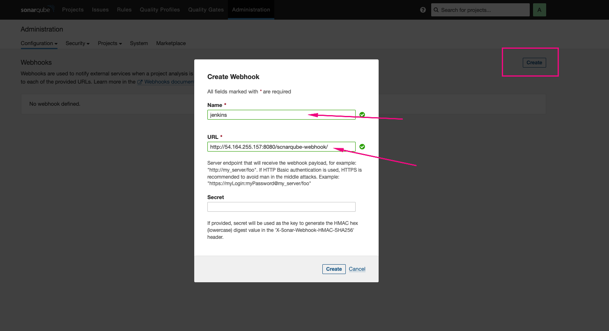

### Step-8 Create a Pipeline

- Go to Jenkins WebUI → New item → Pipeline

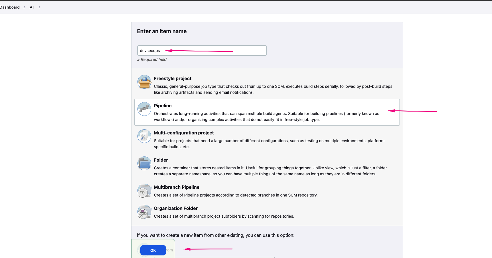

- Add below jenkins code to pipeline section

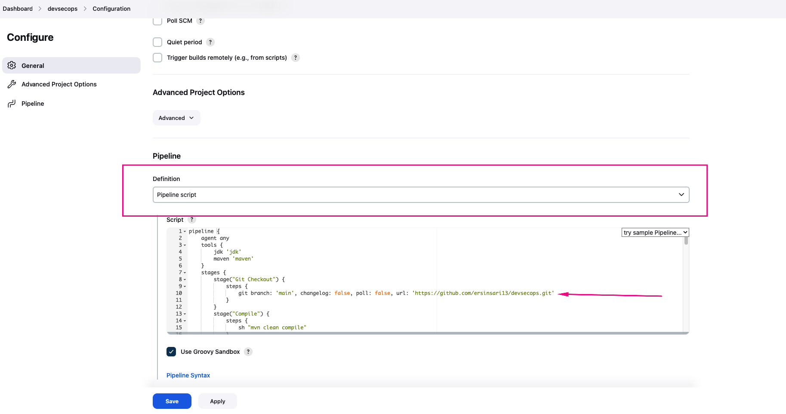

```bash
pipeline {
    agent any
    tools {
        jdk 'jdk'
        maven 'maven'
    }
    options {
        timestamps()
        timeout(time: 30, unit: 'MINUTES')
    }
    stages {
        stage("Git Checkout") {
            steps {
                git branch: 'main', changelog: false, poll: false, url: 'https://github.com/ersinsari13/devsecops.git'
            }
        }

        stage("Compile") {
            steps {
                sh "mvn clean compile"
            }
        }

        stage("Test Cases") {
            steps {
                sh "mvn test"
            }
        }

        stage("Sonarqube Analysis") {
            steps {
                script {
                    withSonarQubeEnv('SonarQubeDefault') {
                        sh '''
                            mvn clean verify sonar:sonar \
                            -Dsonar.projectKey=Petclinic
                        '''
                    }
                }
            }
        }

        stage("Quality Gate") {
            steps {
                timeout(time: 2, unit: 'MINUTES') {
                    script {
                        waitForQualityGate abortPipeline: true
                    }
                }
            }
        }

        stage("Build") {
            steps {
                sh "mvn clean install"
            }
        }

        stage("OWASP-Dependency-Check") {
            steps {
                withCredentials([string(credentialsId: 'NVD_API_KEY', variable: 'NVD_API_KEY')]) {
                    sh '''
                        mvn org.owasp:dependency-check-maven:12.1.0:check \
                        -Dnvd.api.key=$NVD_API_KEY \
                        -Dossindex.api.key=$OSS_API_KEY \
                        -DsuppressionFile=/opt/devsecops/config/dependency-check-suppress.xml \
                        -Danalyzer.nvd.cachevalidforhours=720 || true
                    '''
                }
            }
            post {
                always {
                    dependencyCheckPublisher pattern: 'target/dependency-check-report.xml'
                }
            }
        }

        stage("Scan Dockerfile with Conftest") {
            steps {
                echo 'Scanning Dockerfile'
                sh "docker run --rm -v \$(pwd):/project openpolicyagent/conftest:v0.45.0 test --policy dockerfile-conftest.rego Dockerfile"
            }
        }

        stage("Prepare Tags for Docker Images") {
            steps {
                echo 'Preparing Tags for Docker Images'
                script {
                    // Extract Maven version from pom.xml reliably
                    MVN_VERSION = sh(script: "mvn help:evaluate -Dexpression=project.version -q -DforceStdout", returnStdout: true).trim()
                    env.IMAGE_TAG_DEVSECOPS = "ersinsari/devsecops:${MVN_VERSION}-b${BUILD_NUMBER}"
                }
            }
        }

        stage("Build App Docker Images") {
            steps {
                echo 'Building App Docker Image'
                sh "docker build --force-rm -t ${IMAGE_TAG_DEVSECOPS} ."
                sh 'docker image ls'
            }
        }

        stage("Scan Image with Trivy") {
            steps {
                script {
                    // Scan image and fail pipeline if critical vulnerabilities found
                    def scanResult = sh(script: "trivy image --severity CRITICAL --exit-code 1 ${IMAGE_TAG_DEVSECOPS}", returnStatus: true)
                    if (scanResult != 0) {
                        error "Critical vulnerabilities found in Docker image. Failing the pipeline."
                    }
                    // Optional: save Trivy report
                    sh "trivy image --format json -o trivy-report.json ${IMAGE_TAG_DEVSECOPS} || true"
                    archiveArtifacts artifacts: 'trivy-report.json', fingerprint: true
                }
            }
        }
    }
}

```
- Tools: Specifies the tools needed for the pipeline, in this case, JDK and Maven.
- Git Checkout: Check out the code from the specified Git repository.
- Compile: Runs Maven commands to clean the workspace and compile the code.
- Test Cases: Executes the Maven test phase to run the unit tests.
- SonarQube Analysis: Analyze the code quality using SonarQube.
- Quality Gate: Check the SonarQube quality gate status and abort the pipeline if it fails.
- Build: Runs Maven commands to clean the workspace and install the build artifacts.
- OWASP-Dependency-Check: Perform a security vulnerability check on project dependencies.
- Scan Dockerfile with conftest: Runs Conftest in a Docker container to test the Dockerfile against the specified policy.
- Prepare Tags for Docker Images: Extracts the Maven version from the build and sets the environment variable IMAGE_TAG_DEVSECOPS with the image tag.
- Build App Docker Images: Build the Docker image for the application.
- Scan Image with Trivy: Scans the Docker image for critical vulnerabilities and fails the pipeline if any are found.
- Click Build Now and Open Blue Ocean

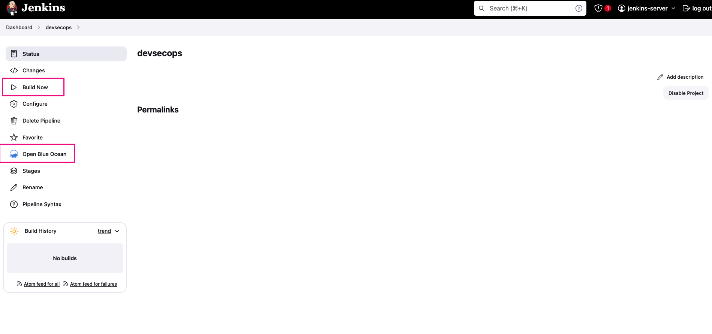

- After the pipeline runs, you should receive a failure at the "Scan Dockerfile with conftest" step; this is a normal occurrence.

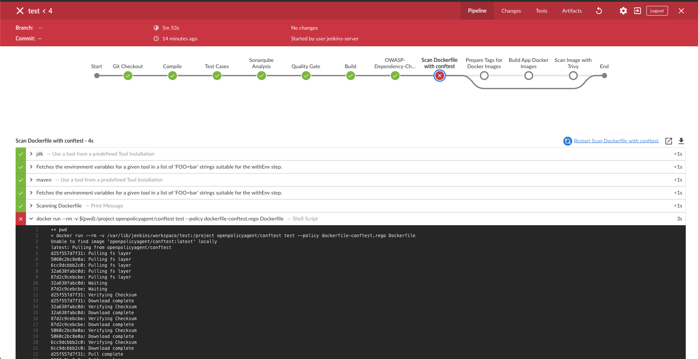

- The reason for this is that if you check the GitHub repository we included in the pipeline, you will see a file named dockerfile-conftest.rego. Conftest performs the Dockerfile scan based on the conditions in this file. We received a failure because the Dockerfile we want to use does not meet the necessary requirements specified. We will correct this.

### Step-9 Sonarqube inspection and add Custom Quality Gate

- But first, let's discuss the pipeline output and then talk a bit about the SonarQube interface and quality gates.

- You can inspect your source code qality by clicking SonarQube section

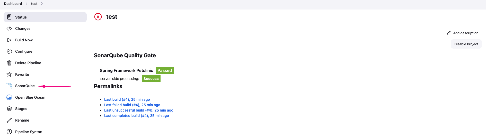

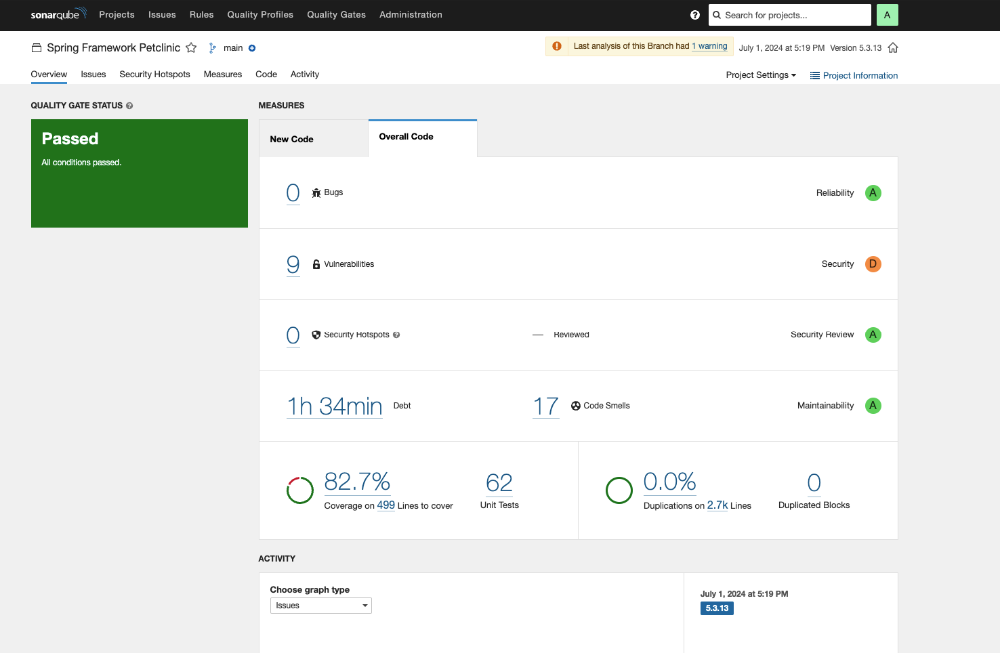

- You can add custom Quality-Gates depends on your company rules

- SonarQube UI click Qualiyy Gates --> Create --> give name and save --> Unlock editing --> Add Condition --> On Overall Code

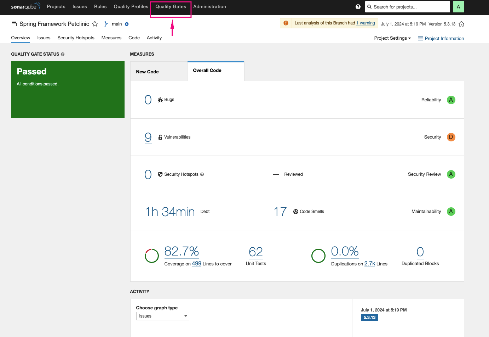

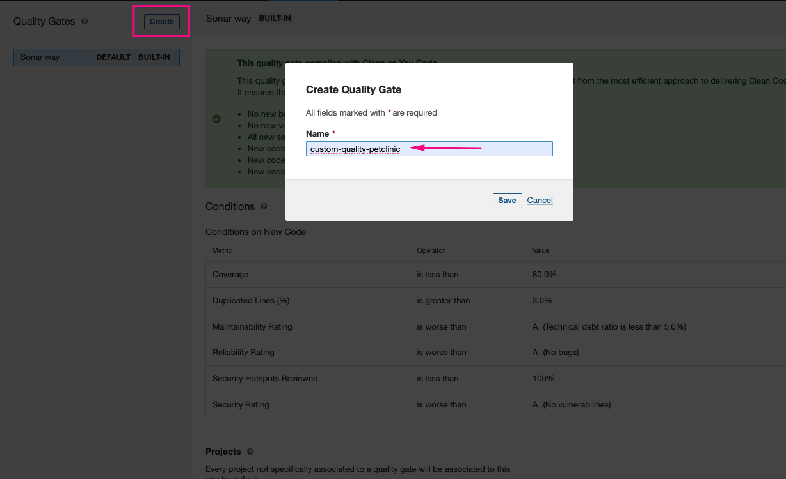

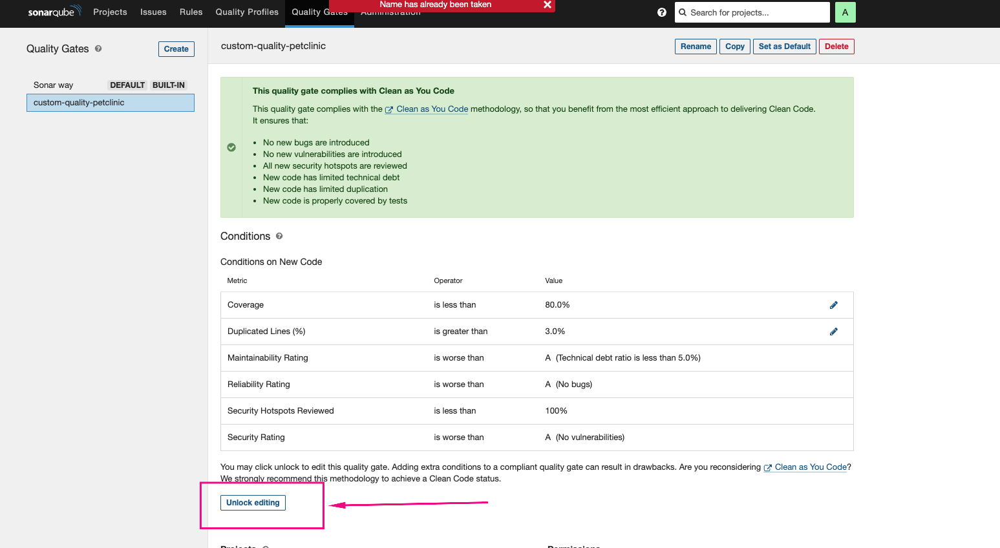

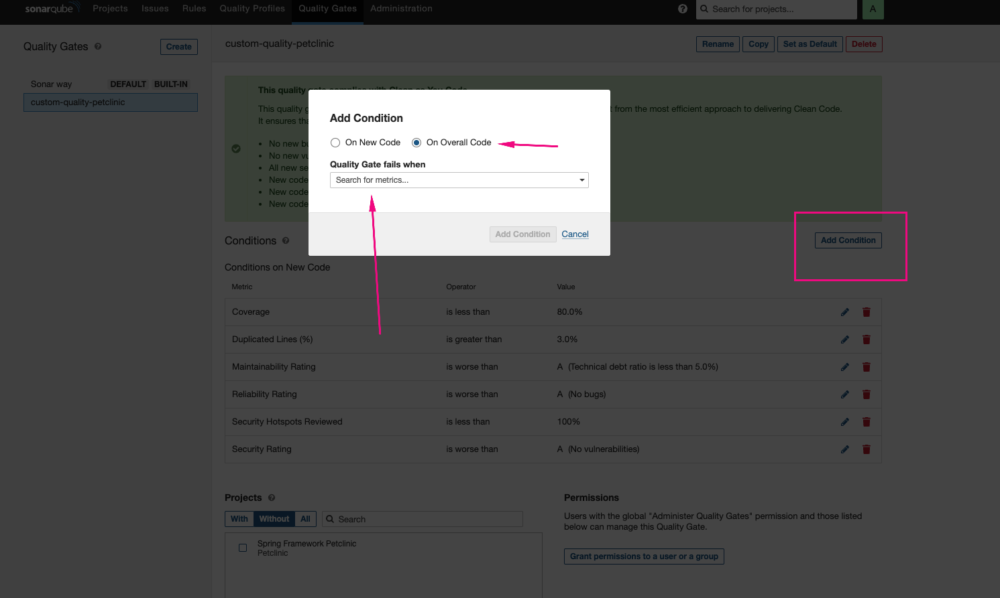

### Step-10 Dependency-Check inspection

- You can inspect your source code dependency-check score by clicking Dependency-Check section

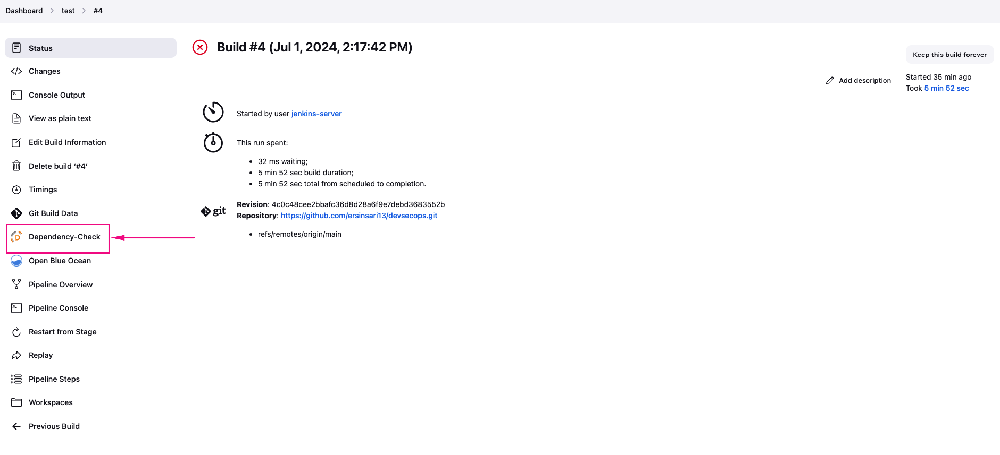

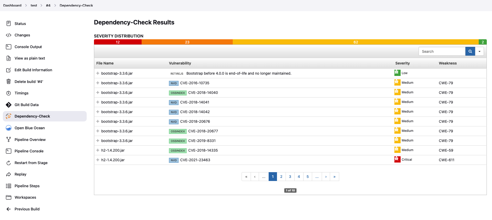

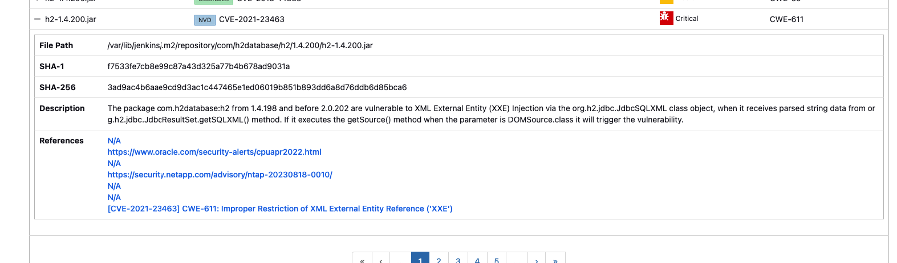

### Step-11 Improving Dockerfile security

Now it's time to improve the Dockerfile security based on the Conftest results.

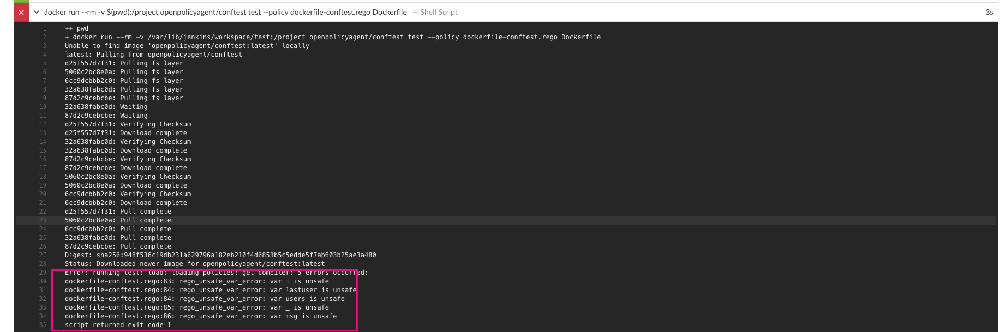

- Change your Dockerfile as below

```bash
FROM openjdk:17

WORKDIR /app
COPY . /app

# Install Maven
RUN microdnf install -y maven

# Build the app
RUN mvn clean package -DskipTests

# Create and use non-root user
RUN useradd -m spring
USER spring

EXPOSE 8080
CMD ["java", "-jar", "target/*.jar"]
```
After this change, you should be able to successfully pass the Dockerfile scanning stage with Conftest.

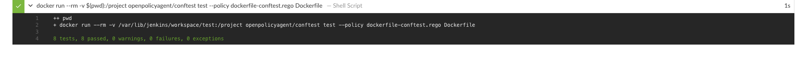

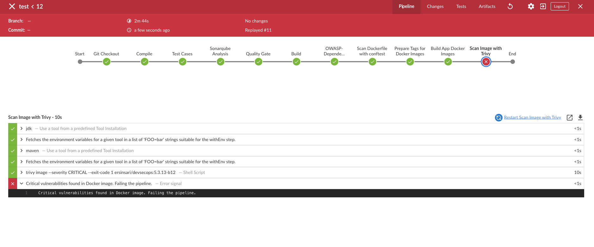

### Step-12 Docker Image Scan via Trivy

Lastly, the pipeline will fail at the image scanning stage with Trivy. If we look at the Jenkinsfile, it is designed to fail if a critical vulnerability is found during the image scan with Trivy. At this stage, the critical vulnerabilities in the image need to be resolved before proceeding. The pipeline output includes recommendations on how to resolve the vulnerabilities.


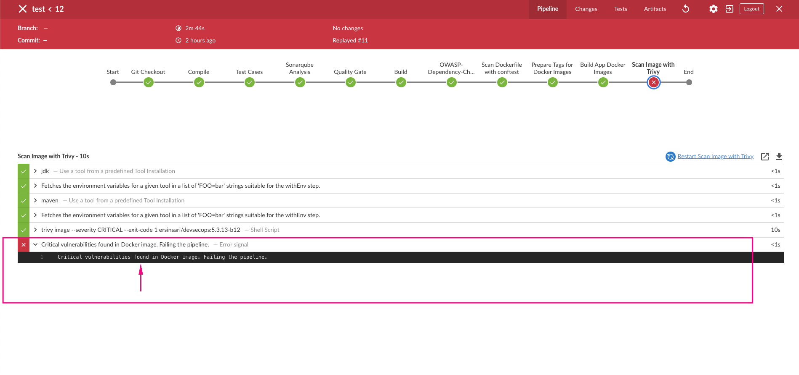

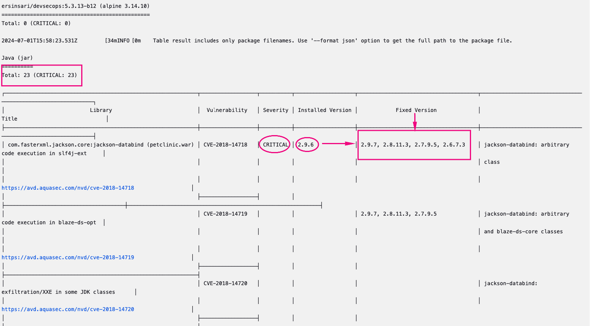


- Once the image scan is successfully completed according to your requirements, the next step is to push the Docker image to the registry and then deploy your application. The key point here is to ensure maximum security before deploying the application, which is what we have aimed to achieve. Have a nice day.
